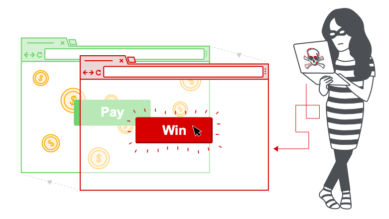

# 点击劫持（UI纠正）

在本节中，我们将解释什么是点击劫持，描述点击劫持攻击的常见示例，并讨论如何防范这些攻击。

## 什么是点击劫持？

点击劫持是一种基于界面的攻击，在这种攻击中，用户通过点击诱饵网站中的其他内容，被诱骗点击隐藏网站上可操作的内容。参考下面的例子:

网络用户访问诱饵网站（也许这是电子邮件提供的链接），然后单击按钮以赢取奖金。 不知不觉中，攻击者欺骗了他们，他们按下了另一个隐藏按钮，从而导致在另一个站点上支付了帐户费用。 这是一个点击劫持攻击的示例。 该技术取决于在iframe中包含按钮或隐藏链接的不可见，可操作的网页（或多个页面）的合并。 iframe覆盖在用户预期的诱饵网页内容之上。 此攻击与CSRF攻击的不同之处在于，要求用户执行诸如单击按钮之类的操作，而CSRF攻击则取决于在用户不知情或输入的情况下伪造整个请求。



通常通过使用CSRF令牌来提供针对CSRF攻击的防护：令牌是特定于会话的，一次性使用的数字或随机数。 CSRF令牌无法缓解点击劫持攻击，因为目标会话是使用从真实网站加载的内容建立的，并且所有请求都在域内发生。 CSRF令牌被放入请求中，并作为正常行为会话的一部分传递到服务器。 与普通用户会话相比，差异在于该过程发生在隐藏的iframe中。

## 如何构建基本的点击劫持攻击

点击劫持攻击使用CSS创建和操纵图层。 攻击者将目标网站合并为诱饵网站上覆盖的iframe图层。 使用样式标签和参数的示例如下：

```markup
<head>
  <style>
    #target_website {
      position:relative;
      width:128px;
      height:128px;
      opacity:0.00001;
      z-index:2;
      }
    #decoy_website {
      position:absolute;
      width:300px;
      height:400px;
      z-index:1;
      }
  </style>
</head>
...
<body>
  <div id="decoy_website">
  ...decoy web content here...
  </div>
  <iframe id="target_website" src="https://vulnerable-website.com">
  </iframe>
</body>
```

目标网站iframe定位在浏览器中，因此使用适当的宽度和高度位置值，目标操作与诱饵网站存在精确的重叠。 无论屏幕大小，浏览器类型和平台如何，绝对位置和相对位置值均用于确保目标网站准确地与诱饵重叠。 z-index确定iframe和网站层的堆叠顺序。 不透明度值定义为0.0（或接近0.0），以使iframe内容对用户透明。 浏览器点击劫持保护可能会应用基于阈值的iframe透明度检测（例如，Chrome版本76包含此行为，而Firefox不包含）。 攻击者选择不透明度值，以便在不触发保护行为的情况下获得所需的效果。

**实验室**[具有CSRF令牌保护功能的基本点击劫持](http://portswigger.cn/academy/subpage/lab/lab-7.html)

## 使用预先填写的表单输入进行点击劫持

一些需要表单填写和提交的网站允许在提交之前使用GET参数预先填充表单输入。 其他网站可能需要文本才能提交表单。 由于GET值构成URL的一部分，因此可以修改目标URL以合并攻击者的选择值，并且如基本点击劫持示例中一样，透明的“提交”按钮覆盖在诱骗站点上。

**实验室**[使用URL参数预填充的表单输入数据进行点击劫持](http://portswigger.cn/academy/subpage/allTopics/all-1.html)

## 框架清除脚本

只要可以对网站进行构架，就有可能发生点击劫持攻击。 因此，预防技术是基于对网站的成帧能力的限制。 通过web浏览器实施的常见客户端保护是使用帧清除或帧中断脚本。这些可以通过专有的浏览器JavaScript附加组件或扩展程序（例如NoScript）来实现。 脚本通常经过精心设计，以使其执行以下某些或全部行为：

* 检查并强制当前应用程序窗口是主窗口还是顶部窗口，
* 使所有框架可见
* 防止点击看不见的框架，
* 拦截并向用户标记潜在的点击劫持攻击。

框架清除技术通常是特定于浏览器和平台的，并且由于HTML的灵活性，它们通常可以被攻击者规避。 由于框架破坏程序是JavaScript，因此浏览器的安全设置可能会阻止其运行，或者实际上浏览器甚至可能不支持JavaScript。 针对框架破坏者的有效攻击者解决方法是使用HTML5 iframe沙箱属性。 如果将此值设置为allow-forms或allow-scripts值，并且省略了allow-top-navigation值，则可以取消框架无效脚本，因为iframe无法检查它是否是顶部窗口：

```markup
<iframe id="victim_website" src="https://victim-website.com" sandbox="allow-forms"></iframe>
```

allow-forms和allow-scripts值都允许在iframe中执行指定的操作，但是顶层导航被禁用。 这抑制了框架破坏行为，同时允许目标站点内的功能。

**实验室**[使用框架破坏脚本的点击劫持](http://portswigger.cn/academy/subpage/allTopics/all-1.html)

## 将点击劫持与DOM相结合 [XSS](http://portswigger.cn/web-security/cross-site-scripting) 攻击

到目前为止，我们将点击劫持视为一种独立的攻击。 从历史上看，点击劫持曾被用来在Facebook页面上执行诸如增加“喜欢”之类的行为。 但是，当点击劫持被用作诸如DOM XSS攻击之类的另一种攻击的载体时，就可以揭示其真正的效力。 假设攻击者首先确定了XSS攻击，则此组合攻击的实现相对简单。 然后，将XSS利用与iframe目标URL结合在一起，以便用户单击按钮或链接，从而执行DOM XSS攻击。

**实验室**[利用点击劫持漏洞来触发基于DOM的XSS](http://portswigger.cn/academy/subpage/lab/dom-xss.html)

## 多步骤点击劫持

攻击者操纵目标网站的输入可能需要采取多种措施。 例如，攻击者可能想诱使用户从零售网站上购买商品，因此需要在下订单之前将商品添加到购物篮中。 攻击者可以使用多个区块或iframe实施这些操作。 从攻击者的角度来看，这样的攻击需要相当大的精确度和谨慎性，才能使其有效和隐秘。

**实验室**[多步骤点击劫持](http://portswigger.cn/academy/subpage/allTopics/all-1.html#)

## 如何防止点击劫持攻击

我们已经讨论了一种常见的浏览器端防护机制，即框架清除脚本。 但是，我们已经看到，攻击者通常很容易避开这些保护措施。 因此，已设计出服务器驱动的协议，以限制浏览器iframe的使用并减轻点击劫持。

点击劫持是浏览器端的行为，它的成功与否取决于浏览器的功能以及对现行web标准和最佳实践的符合性。 通过在使用iframe之类的组件时定义和传达约束，可以提供服务器端防止点击劫持的保护。 但是，保护的实现取决于浏览器的遵从性和这些约束的实施。 服务器端点击劫持保护的两种机制是X-Frame-Options和Content Security Policy。

#### 了解更多

[使用Burp Suite的网络漏洞扫描程序查找点击劫持漏洞](http://portswigger.cn/academy/subpage/allTopics/all-1.html#)

### X-Frame-Options

X-Frame-Options最初是作为Internet Explorer 8中的非官方响应标头引入的，并在其他浏览器中迅速采用。 标头为网站所有者提供了使用iframe或对象的控制权，因此可以使用deny指令禁止将网页包含在框架中：

`X-Frame-Options: deny`

或者，可以使用sameorigin指令将框架限制为与网站具有相同的来源

`X-Frame-Options: sameorigin`

或使用allow-from指令访问命名网站：

`X-Frame-Options: allow-from https://normal-website.com`

X-Frame-Options在各个浏览器中的实现方式不一致（例如，Chrome 76或Safari 12不支持allow-from指令）。 但是，当与内容安全策略一起作为多层防御策略的一部分正确应用时，它可以提供有效的保护，以防止点击劫持攻击。

### 内容安全政策（CSP）

内容安全策略（CSP）是一种检测和预防机制，可缓解XSS和Clickjacking等攻击。 CSP通常在web服务器中实现为以下形式的返回标头

`Content-Security-Policy: policy`

其中policy是由分号分隔的一串策略指令。 CSP向客户端浏览器提供有关允许的web资源来源的信息，浏览器可以将这些资源应用于检测和拦截恶意行为。

建议的点击劫持保护是将frame-ancestors指令合并到应用程序的内容安全策略中。 frame-ancestors'none'指令的行为与X-Frame-Options deny指令相似。 frame-ancestors的“ self”指令与X-Frame-Options sameorigin指令大致等效。 以下CSP仅将框架列入白名单：

`Content-Security-Policy: frame-ancestors 'self';`

或者，可以将框架限制为命名站点：

`Content-Security-Policy: frame-ancestors normal-website.com;`

为了有效地防止点击劫持和XSS，CSP需要进行仔细的开发、实施和测试，并应被用作多层防御策略的一部分。

