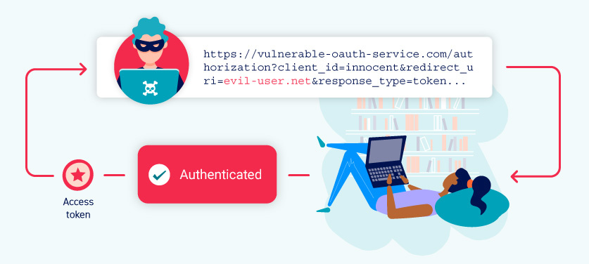

# OAuth 2.0认证漏洞

在浏览网页时，你几乎肯定遇到过让你使用社交媒体账户登录的网站。这个功能有可能是使用流行的OAuth 2.0框架建立的。对于攻击者来说，OAuth 2.0是非常有趣的，因为它既非常普遍，又在本质上容易出现实施错误。这可能会导致一些漏洞，让攻击者获得敏感的用户数据，并有可能完全绕过认证。

在本节中，我们将教你如何识别和利用OAuth 2.0认证机制中的一些关键漏洞。如果你对OAuth认证不太熟悉，也不用担心，我们已经提供了大量的背景信息，帮助你理解你所需要的关键概念。我们还将探讨OAuth的OpenID Connect扩展中的一些漏洞。最后，我们还包括一些关于如何保护你自己的应用程序免受这类攻击的指导。



像往常一样，我们提供了一系列故意存在漏洞的网站，称为“实验室”，这样你就可以在实践中看到这些漏洞，并把你所学到的关于利用这些漏洞的知识用于测试。如果你喜欢直接进入实验，你可以从我们的实验室索引页上访问完整的列表。

> 实验：[OAuth身份认证实验](https://portswigger.net/web-security/all-labs#oauth-authentication)

## OAuth是什么？

OAuth是一个常用的授权框架，使网站和网络应用程序能够请求对另一个应用程序的用户账户进行有限的访问。最重要的是，OAuth允许用户授予这种访问权，而不向提出请求的应用程序暴露他们的登录凭证。这意味着用户可以微调他们想要分享的数据，而不是把他们账户的全部控制权交给第三方。

基本的OAuth流程被广泛用于整合需要访问用户账户中某些数据的第三方功能。例如，一个应用程序可能会使用OAuth来请求访问你的电子邮件联系人列表，以便它能够建议与之联系的人。然而，同样的机制也被用来提供第三方认证服务，允许用户用他们在不同网站的账户登录。

> **注意**
>
> 虽然OAuth 2.0是目前的标准，但有些网站仍然使用传统的1a版本。OAuth 2.0是从头开始编写的，而不是直接从OAuth 1.0开发的。因此，两者有很大的不同。请注意，在这些材料中，“OAuth”一词专指OAuth 2.0。

## OAuth 2.0是如何工作的？

OAuth 2.0最初是作为一种在应用程序之间共享访问特定数据的方式而开发的。它的工作原理是在三个不同的当事方之间定义一系列的互动，即客户端应用程序、资源所有者和OAuth服务提供者。

* **客户端应用程序**：想要访问用户数据的网站或网络应用。 
* **资源所有者**：客户端应用程序想要访问其数据的用户。 
* **OAuth服务提供商**：控制用户数据和访问数据的网站或应用程序。他们支持OAuth，提供与授权服务器和资源服务器交互的API。

实际的OAuth流程可以有许多不同的实现方式。这些被称为OAuth“流程”（flows）或“授予类型”（grant types）。在本专题中，我们将重点讨论“授权码”和“implicit”授予类型，因为这些是迄今为止最常见的。概括地说，这两种授予类型都涉及以下阶段：

1. 客户端应用程序请求访问用户的数据子集，指定他们想要使用的授予类型以及他们想要的访问类型。 
2. 用户会被提示登录到OAuth服务，并明确表示同意所请求的访问。 
3. 客户端应用程序会收到一个独特的访问令牌，证明他们有来自用户的访问请求数据的权限。具体如何发生，因授予类型不同而有很大差异。 
4. 客户端应用程序使用该访问令牌进行API调用，从资源服务器获取相关数据。

在学习OAuth如何用于认证之前，重要的是要了解这个基本的OAuth流程的基本原理。如果你对OAuth完全陌生，我们建议在进一步阅读之前，先熟悉一下我们将要介绍的两种授予类型的细节。

> 阅读更多
>
> [OAuth授权类型](https://portswigger.net/web-security/oauth/grant-types)

## OAuth身份验证

虽然最初不是为了这个目的，但OAuth也已经发展成为一种验证用户的手段。例如，你可能很熟悉许多网站提供的选项，即使用你现有的社交媒体账户登录，而不必在有关网站注册。每当你看到这个选项，很有可能它是建立在OAuth 2.0的基础上。

对于OAuth认证机制，基本的OAuth流程基本保持不变；主要的区别在于客户端应用程序如何使用它所收到的数据。从终端用户的角度来看，OAuth认证的结果是大致类似于基于SAML的单点登录（SSO）。在这些材料中，我们将专门关注这种类似SSO的用例中的漏洞。

OAuth认证的实现方式一般如下：

1. 用户选择用他们的社交媒体账户登录。然后，客户端应用程序使用社交媒体网站的OAuth服务，请求访问一些可以用来识别用户的数据。例如，这可能是他们账户中注册的电子邮件地址。 
2. 在收到访问令牌后，客户端应用程序从资源服务器请求这些数据，通常是从一个专门的`/userinfo`端点。 
3. 一旦收到这些数据，客户端应用程序就会用它来代替用户名来登录用户。它从授权服务器收到的访问令牌通常被用来代替传统的密码。 

你可以在下面的实验中看到一个简单的例子，说明这一点。只要在通过Burp代理流量时完成“用社交媒体登录”选项，然后研究代理历史中的一系列OAuth交互。你可以使用凭证`wiener:peter`来登录。请注意，这种实现方式是故意脆弱的 - 我们将在后面教你如何利用这一点。

> 实验：[通过OAuth隐式流程来绕过认证](https://portswigger.net/web-security/oauth/lab-oauth-authentication-bypass-via-oauth-implicit-flow)

## OAuth认证漏洞是如何产生的？

OAuth认证漏洞的出现，部分原因是OAuth规范的设计相对模糊和灵活。虽然每一种授予类型的基本功能都需要一些强制性的组件，但绝大部分的实现都是完全可选的。这包括许多为保证用户数据安全所必需的配置设置。简而言之，有很多机会让不好的做法悄悄进入。

OAuth的其他关键问题之一是普遍缺乏内置的安全功能。安全性几乎完全依赖于开发人员使用正确的配置选项组合，并在上面实施他们自己的额外安全措施，如强大的输入验证。正如你可能已经收集到的，有很多东西需要接受，如果你对OAuth没有经验，这很容易出错。

根据授予类型的不同，高度敏感的数据也会通过浏览器发送，这为攻击者提供了各种拦截的机会。

## 识别OAuth认证

识别一个应用程序是否使用了OAuth认证是相对简单的。如果你看到一个选项，可以使用你的账户从不同的网站登录，这是一个强有力的迹象，表明OAuth正在被使用。

识别OAuth认证最可靠的方法是通过Burp代理你的流量，并在你使用这个登录选项时检查相应的HTTP消息。无论使用的是哪种OAuth授权类型，流量的第一个请求都是对`/authorization`端点的请求，其中包含一些专门用于OAuth的查询参数。特别是要注意`client_id`、`redirect_uri`和`response_type`参数。例如，一个授权请求通常会是这样的：

```http
GET /authorization?client_id=12345&redirect_uri=https://client-app.com/callback&response_type=token&scope=openid%20profile&state=ae13d489bd00e3c24 HTTP/1.1
Host: oauth-authorization-server.com
```

## 侦察

对正在使用的OAuth服务做一些基本的侦察，可以在识别漏洞时为你指明正确的方向。

不言而喻，你应该研究构成OAuth流程的各种HTTP交互 - 我们将在后面讨论一些具体的东西。如果使用的是外部OAuth服务，你应该能够从授权请求所发的主机名中识别出具体的提供者。由于这些服务提供了公共的API，通常会有详细的文档，应该可以告诉你各种有用的信息，比如端点的确切名称和正在使用的配置选项。

一旦你知道了授权服务器的主机名，你就应该尝试向以下标准端点发送`GET`请求：

* `/.well-known/oauth-authorization-server`
* `/.well-known/openid-configuration`

这些通常会返回一个包含关键信息的JSON配置文件，例如可能支持的额外功能的细节。这有时会提示你一个更广泛的攻击面和支持的功能，这些功能可能在文档中没有提到。

## OAuth认证漏洞利用

漏洞可能出现在客户端应用程序对OAuth的实现，以及OAuth服务本身的配置。在本节中，我们将告诉你如何利用这两种情况下的一些最常见的漏洞。

* 客户端应用程序中的漏洞
  * [隐式授权类型的不正确实现](https://portswigger.net/web-security/oauth#improper-implementation-of-the-implicit-grant-type)
  * [有缺陷的CSRF保护](https://portswigger.net/web-security/oauth#flawed-csrf-protection)
* OAuth服务端中的漏洞
  * [泄露授权码和访问令牌](https://portswigger.net/web-security/oauth#leaking-authorization-codes-and-access-tokens)
  * [有缺陷的范围验证](https://portswigger.net/web-security/oauth#flawed-scope-validation)
  * [未经验证的用户注册](https://portswigger.net/web-security/oauth#unverified-user-registration)

### 客户端应用程序中的漏洞

客户端应用程序通常会使用知名的、经过实战考验的OAuth服务，该服务可以很好地防止众所周知的漏洞。然而，他们自己方面的实现可能不太安全。

正如我们已经提到的，OAuth规范的定义是相对宽松的。这一点在客户端应用程序的实现方面尤其如此。在一个OAuth流程中，有很多移动的部分，每个授予类型都有很多可选参数和配置设置，这意味着有很多错误配置的空间。

#### 隐式授权类型的不正确实现

由于通过浏览器发送访问令牌所带来的危险，隐式授予类型主要被推荐用于单页应用程序。然而，由于其相对简单，它也经常被用于经典的客户端-服务器网络应用中。

在这个流程中，访问令牌是通过用户的浏览器以URL片段的形式从OAuth服务发送到客户端应用程序的。然后，客户端应用程序使用JavaScript访问该令牌。问题是，如果应用程序想在用户关闭页面后保持会话，它需要在某个地方存储当前的用户数据（通常是用户ID和访问令牌）。

为了解决这个问题，客户端应用程序通常会在一个`POST`请求中把这些数据提交给服务器，然后给用户分配一个会话cookie，有效地登录他们。这个请求大致等同于可能作为传统的、基于密码的登录的一部分而发送的表单提交请求。然而，在这种情况下，服务器没有任何秘密或密码来与提交的数据进行比较，这意味着它是隐式信任的。

在隐式流程中，这个`POST`请求通过浏览器暴露给攻击者。因此，如果客户端应用程序没有正确检查访问令牌是否与请求中的其他数据相匹配，这种行为会导致严重的漏洞。在这种情况下，攻击者可以简单地改变发送到服务器的参数，以冒充任何用户。

> 实验：[通过OAuth隐式流绕过身份验证](https://portswigger.net/web-security/oauth/lab-oauth-authentication-bypass-via-oauth-implicit-flow)

#### 有缺陷的CSRF保护

虽然OAuth流程中的许多组件都是可选的，但有些组件是强烈推荐的，除非有重要的理由不使用它们。其中一个例子就是`state`参数。

状态参数最好包含一个不可猜测的值，例如当用户第一次启动OAuth流程时，与用户会话绑定的哈希值。然后这个值会在客户端应用程序和OAuth服务之间来回传递，作为客户端应用程序的CSRF令牌形式。因此，如果你注意到授权请求没有发送一个`state`参数，从攻击者的角度来看，这是非常有趣的。这有可能意味着他们可以在欺骗用户的浏览器完成OAuth流程之前，自己启动一个OAuth流程，类似于传统的CSRF攻击。可能会产生严重的后果，这取决于客户端应用程序是如何使用OAuth的。

考虑到一个网站，允许用户使用传统的、基于密码的机制或通过使用OAuth将他们的账户与社交媒体资料链接来登录。在这种情况下，如果应用程序没有使用`state`参数，攻击者就有可能通过将客户的账户绑定到他们自己的社交媒体账户来劫持客户应用程序上的受害用户。

> 实验：[强制OAuth配置文件链接](https://portswigger.net/web-security/oauth/lab-oauth-forced-oauth-profile-linking)

请注意，如果网站允许用户完全通过OAuth登录，`state`参数可以说不那么关键。然而，不使用`state`参数仍然可以让攻击者构建登录CSRF攻击，即用户被欺骗登录到攻击者的账户中。

### 泄露授权码和访问令牌

也许最臭名昭著的基于OAuth的漏洞是当OAuth服务本身的配置使攻击者能够窃取与其他用户的账户相关的授权码或访问令牌。通过窃取有效的代码或令牌，攻击者可能能够访问受害者的数据。最终，这可能会完全破坏他们的账户 - 攻击者有可能在任何注册了该OAuth服务的客户端应用程序上以受害者用户的身份登录。

根据授予类型，代码或令牌将通过受害者的浏览器发送到授权请求的`redirect_uri`参数中指定的`/callback`端点。如果OAuth服务不能正确地验证这个URI，攻击者可能会构建一个类似CSRF的攻击，诱使受害者的浏览器启动一个OAuth流程，将代码或令牌发送到攻击者控制的`redirect_uri`。

在授权码流的情况下，攻击者有可能在受害者的代码被使用之前窃取它。然后，他们可以把这个代码发送到客户端应用程序的合法`/callback`端点（原来的`redirect_uri`），以获得对用户账户的访问。在这种情况下，攻击者甚至不需要知道客户端的秘密或由此产生的访问令牌。只要受害者与OAuth服务有一个有效的会话，客户端应用程序将简单地代表攻击者完成code/token交换，然后再登录到受害者的账户。

请注意，使用`state`或`nonce`保护并不一定能防止这些攻击，因为攻击者可以从他们自己的浏览器生成新的值。

> 实验：[通过redirect\_uri劫持OAuth账户](https://portswigger.net/web-security/oauth/lab-oauth-account-hijacking-via-redirect-uri)

更安全的授权服务器会要求在交换代码时发送一个`redirect_uri`参数。然后，服务器可以检查这个参数是否与它在初始授权请求中收到的参数相匹配，如果不匹配，则拒绝交换。由于这发生在通过安全的反向通道的服务器到服务器的请求中，攻击者无法控制这第二个`redirect_uri`参数。

#### **有缺陷的 redirect\_uri 验证**

由于在前面的实验室中看到的各种攻击，最好的做法是客户应用程序在向OAuth服务注册时，提供一个真正的回调URI白名单。这样，当OAuth服务收到一个新的请求时，它可以根据这个白名单验证`redirect_uri`参数。在这种情况下，提供一个外部URI可能会导致错误。然而，仍然可能有办法绕过这个验证。

在审计OAuth流程时，你应该尝试用`redirect_uri`参数进行实验，以了解它是如何被验证的。比如说：

* 一些实现允许子目录的范围，只检查字符串是否以正确的字符序列开始，即一个被批准的域。你应该尝试删除或添加任意的路径、查询参数和片段，看看你能改变什么而不触发错误。
* 如果你能给默认的`redirect_uri`参数添加额外的值，你也许能利用OAuth服务的不同组件对URI的解析之间的差异。例如，你可以尝试以下技术：  
  `https://default-host.com &@foo.evil-user.net#@bar.evil-user.net/`

  如果你不熟悉这些技术，我们建议阅读我们关于如何规避常见的SSRF防御和CORS的内容。

* 你可能偶尔会遇到服务器端的参数污染漏洞。为了以防万一，你应该尝试提交重复的`redirect_uri`参数，如下：

  `https://oauth-authorization-server.com/?client_id=123&redirect_uri=client-app.com/callback&redirect_uri=evil-user.net`

* 一些服务器也对`localhost` URI进行特殊处理，因为它们经常在开发期间使用。在某些情况下，任何以`localhost`开头的重定向URI在生产环境中可能会被意外地允许。这可能允许你通过注册一个域名绕过验证，例如`localhost.evil-user.net`。

值得注意的是，你不应该把你的测试限制在只是孤立地探测`redirect_uri`参数上。在野外，你经常需要对几个参数的不同组合进行试验。有时改变一个参数会影响其他参数的验证。例如，将`response_mode`从`query`改为`fragment`，有时可以完全改变`redirect_uri`的解析，使你可以提交否则会被阻止的URI。同样，如果你注意到支持`web_message`的响应模式，这通常允许在`redirect_uri`中有更大范围的子域。

#### 通过代理页面窃取代码和访问令牌

面对更强大的目标，你可能会发现，无论你怎么尝试，你都无法成功地提交一个外部域作为`redirect_uri`。然而，这并不意味着是时候放弃了。

到了这个阶段，你应该对URI的哪些部分可以篡改有了比较好的了解。现在的关键是利用这些知识，试图在客户端应用程序本身中获得更广泛的攻击面。换句话说，试着找出你是否可以改变`redirect_uri`参数，使其指向白名单上的任何其他页面。

尝试找到可以成功访问不同子域或路径的方法。例如，默认的URI通常会在一个OAuth的特定路径上，如`/oauth/callback`，这不太可能有任何有趣的子目录。然而，你可以使用目录遍历的技巧来提供域上的任何任意路径。就像这样：

`https://client-app.com/oauth/callback/../../example/path`

在后端可能被解释为：

`https://client-app.com/example/path`

一旦你确定了哪些其他的页面你能够设置为重定向URI，你就应该审计它们是否有额外的漏洞，你可以潜在地利用这些漏洞来泄露代码或令牌。对于授权码流，你需要找到一个能让你访问查询参数的漏洞，而对于隐式授予类型，你需要提取URL片段。

为此，最有用的漏洞之一是开放重定向。你可以把它作为一个代理，把受害者连同他们的代码或令牌一起转发到一个攻击者控制的域，在那里你可以托管任何你喜欢的恶意脚本。

请注意，对于隐式授予类型，窃取访问令牌并不只是让你能够在客户端应用程序上登录到受害者的账户。由于整个隐式流程是通过浏览器进行的，你也可以使用该令牌对OAuth服务的资源服务器进行自己的API调用。这可能使你能够获取你通常无法从客户端应用程序的网页用户界面访问的敏感用户数据。

> 实验：[通过打开重定向窃取OAuth访问令牌](https://portswigger.net/web-security/oauth/lab-oauth-stealing-oauth-access-tokens-via-an-open-redirect)

除了开放重定向，你应该寻找任何其他的漏洞，允许你提取代码或令牌并将其发送到外部域。一些好的例子包括：

* **处理查询参数和URL片段的危险的JavaScript**

  例如，不安全的网络信息传递脚本可以很好地实现这一点。在某些情况下，你可能要确定一个较长的小工具链，让你在最终将令牌泄露给你的外部域之前，通过一系列的脚本来传递。 

* **XSS漏洞**

  尽管XSS攻击本身会产生巨大的影响，但在用户关闭标签或导航离开之前，攻击者通常会有一小段时间可以访问用户的会话。由于`HTTPOnly`属性通常用于会话cookie，攻击者通常也无法使用XSS直接访问它们。然而，通过窃取OAuth代码或令牌，攻击者可以在他们自己的浏览器中获得对用户账户的访问。这使他们有更多的时间来探索用户的数据并进行有害的操作，大大增加了XSS漏洞的严重性。

* **HTML注入漏洞**

  在不能注入JavaScript的情况下（例如，由于CSP的限制或严格的过滤），你可能仍然能够使用一个简单的HTML注入来窃取授权码。如果你能将`redirect_uri`参数指向一个可以注入你自己的HTML内容的页面，你可能就能通过`Referer`头泄露代码。例如，考虑下面这个img元素：``。当试图获取这张图片时，一些浏览器（如Firefox）会在请求的`Referer`头中发送完整的URL，包括查询字符串。

> 实验：[通过代理页面窃取OAuth访问令牌](https://portswigger.net/web-security/oauth/lab-oauth-stealing-oauth-access-tokens-via-a-proxy-page)

#### 有缺陷的范围验证

在任何OAuth流程中，用户必须根据授权请求中定义的范围批准请求的访问。由此产生的令牌只允许客户端应用程序访问由用户批准的范围。但在某些情况下，由于OAuth服务的验证有缺陷，攻击者有可能“升级”访问令牌（无论是偷来的还是用恶意的客户端应用程序获得的），使其具有额外的权限。这样做的过程取决于授予的类型。

范围升级：授权码流程

使用授权码授予类型，用户的数据是通过安全的服务器到服务器的通信来请求和发送的，第三方攻击者通常无法直接操纵。然而，仍有可能通过在OAuth服务中注册他们自己的客户端应用程序来实现同样的结果。

例如，假设攻击者的恶意客户端应用程序最初使用`openid email`范围请求访问用户的电子邮件地址。在用户批准这个请求后，恶意的客户端应用程序会收到一个授权码。由于攻击者控制了他们的客户端应用程序，他们可以在code/token交换请求中添加另一个`scope`参数，包含额外的`profile`范围：

```http
POST /token
Host: oauth-authorization-server.com
…
client_id=12345&client_secret=SECRET&redirect_uri=https://client-app.com/callback&grant_type=authorization_code&code=a1b2c3d4e5f6g7h8&scope=openid%20 email%20profile
```

如果服务器没有根据初始授权请求的范围进行验证，它有时会使用新的范围生成一个访问令牌，并将其发送给攻击者的客户端应用程序：

```http
{
  "access_token": "z0y9x8w7v6u5",
  "token_type": "Bearer",
  "expires_in": 3600,
  "scope": "openid email profile",
  …
}
```

然后，攻击者可以使用他们的应用程序进行必要的API调用，访问用户的个人资料数据。

范围升级:隐式流程

对于隐式授予类型，访问令牌是通过浏览器发送的，这意味着攻击者可以窃取与无辜的客户端应用程序相关的令牌并直接使用它们。一旦他们窃取了访问令牌，他们可以向OAuth服务的`/userinfo`端点发送一个正常的基于浏览器的请求，在这个过程中手动添加一个新的`scope`参数。

理想情况下，OAuth服务应该用生成令牌时使用的`scope`值来验证这个范围，但这并不总是如此。只要调整后的权限不超过先前授予该客户端应用程序的访问级别，攻击者就有可能访问更多的数据，而不需要用户的进一步批准。

### 未经验证的用户注册

当通过OAuth认证用户时，客户端应用程序会隐含地假设OAuth提供者所存储的信息是正确的。这可能是一个危险的假设。

一些提供OAuth服务的网站允许用户在没有验证他们所有细节的情况下注册一个账户，在某些情况下包括他们的电子邮件地址。攻击者可以利用这一点，使用与目标用户相同的细节，如已知的电子邮件地址，向OAuth提供商注册一个账户。客户端应用程序可能会允许攻击者通过这个欺诈性的OAuth提供商的账户作为受害者登录。

## 使用OpenID Connect扩展OAuth

当用于认证时，OAuth通常会用OpenID Connect层来扩展，它提供了一些与识别和认证用户有关的额外功能。关于这些功能的详细描述，以及一些与它们可能带来的漏洞有关的实验室，请参见我们的OpenID Connect专题。

> 阅读更多
>
> [OpenID Connect](https://portswigger.net/web-security/oauth/openid)

## 防止OAuth身份验证漏洞

对于开发人员，我们提供了一些有关如何避免将这些漏洞引入您自己的网站和应用程序的指南。

> 阅读更多
>
> [如何防止OAuth身份验证漏洞](https://portswigger.net/web-security/oauth/preventing)

